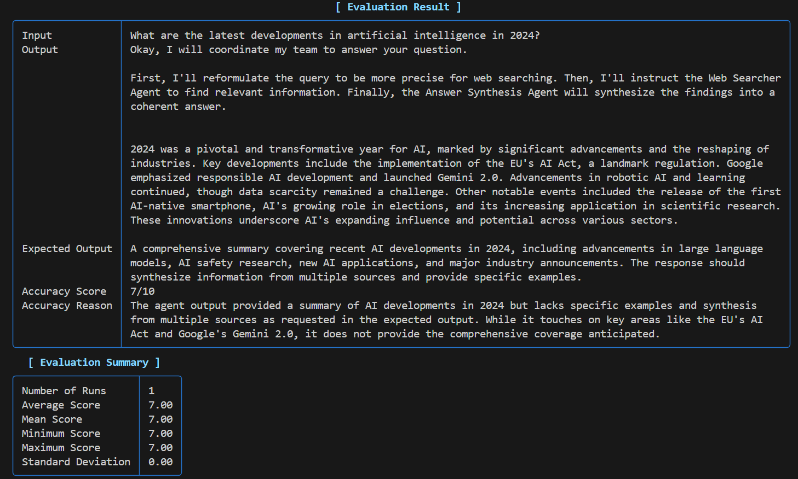

Evaluation
--
This is an advanced example script that demonstrates how to orchestrate a team of AI agents for web search, synthesis, and automated evaluation using the Agno framework and the Gemini language model.

Key Features:
1. Defines a multi-agent team:

      i. Query Reformulator Agent: Improves user queries for more effective searching.
    
      ii. Web Searcher Agent: Uses DuckDuckGo tools to search the web for relevant information.
    
      iii. Answer Synthesis Agent: Synthesizes information from multiple articles into a coherent answer.

2. Coordinates these agents as a team using the Team class, so each agent performs its task in sequence, passing results to the next.

**Automated Evaluation**

A key feature of this script is the use of the AccuracyEval class to automatically evaluate the performance of the agent team:
1. Defines an evaluation scenario with a specific input question and an expected output description.
2. Runs the evaluation by having the team answer the question and comparing the response to the expected output.
3. Prints evaluation results for transparency and debugging, helping you measure the quality and relevance of the team’s answers.
4. This enables you to benchmark and iterate on your multi-agent workflows with real, automated feedback—making it easier to improve your AI system’s accuracy and reliability.

⚙️ Setup

Create a .env file in the project root:

```GOOGLE_API_KEY=your-api-key-here```

▶️ Run the script

```python web-teams.py```


This script is ideal for building, testing, and evaluating collaborative AI agent workflows for complex information retrieval and synthesis tasks.

**OUTPUT**:


