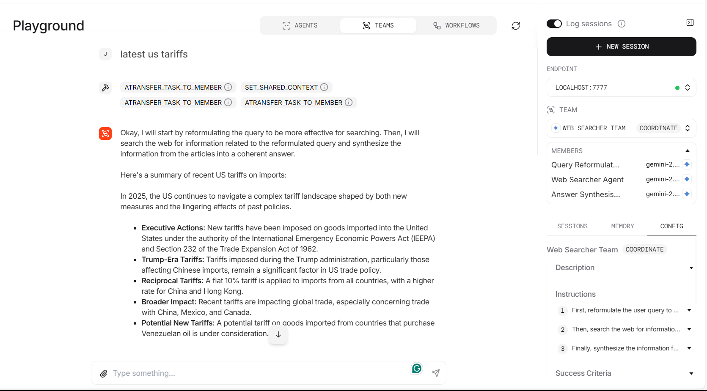
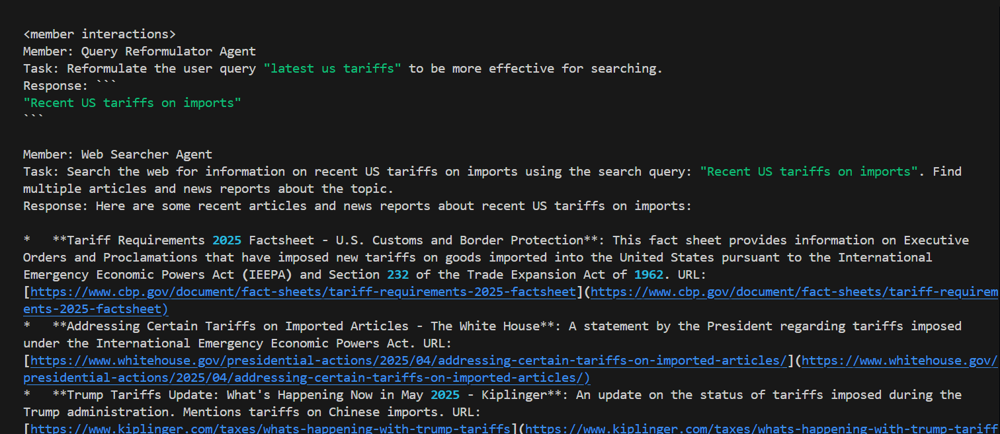
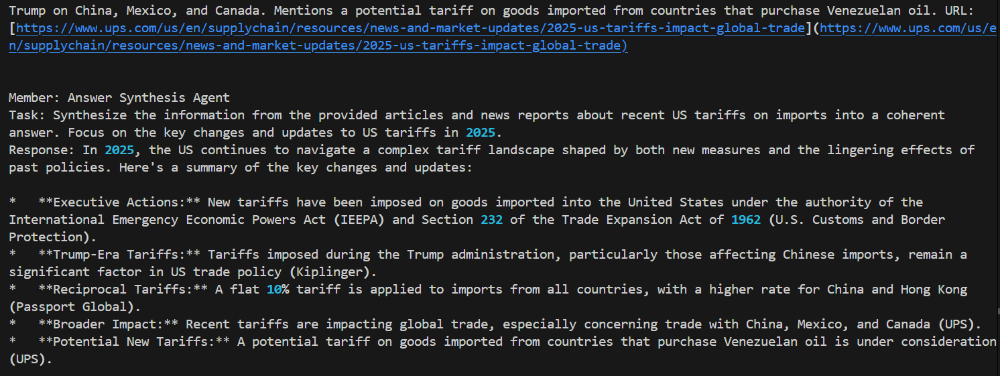
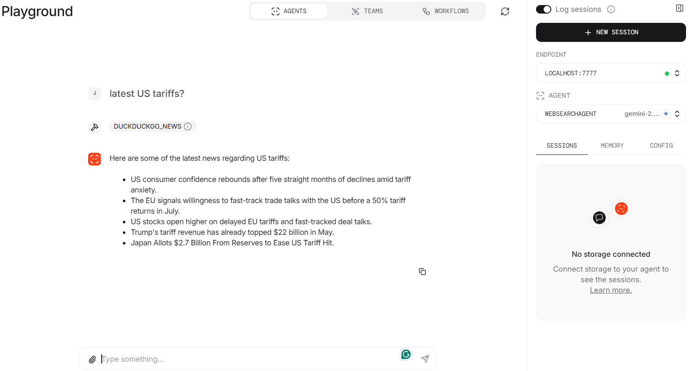

**web-teams:**
--
web-teams.py is an example of orchestrating multiple AI agents as a collaborative team to perform advanced web search and synthesis tasks using the agno framework.

🔑Key Features:
1. It defines three specialized agents:
    - Query Reformulator Agent: Improves user queries for more effective searching.
    - Web Searcher Agent: Uses [DuckDuckGo](https://duckduckgo.com/) to search the web based on the reformulated query.
    - Answer Synthesis Agent: Synthesizes information from multiple articles into a coherent answer.
2. Coordinates these agents as a team using the Team class, so each agent performs its task in sequence, passing results to the next.
3. Enables advanced features such as tool usage visibility, markdown formatting, debug mode, and sharing of context/history among agents.

⚙️ Setup

Create a .env file in the project root:

```GOOGLE_API_KEY=your-api-key-here```

▶️ Run the script

```python web-teams.py```

This file demonstrates how to build modular, collaborative AI workflows for complex information retrieval and summarization tasks.

OUTPUT:


CLI:



**websearch:**
--
websearch.py is a sample script demonstrating how to build an AI-powered web search agent using the agno framework.

Creates a single AI agent (WebSearchAgent) that:
- Uses the Gemini language model for understanding and generating responses.
- Integrates DuckDuckGo search tools to fetch real-time web results.
- Streams responses and intermediate reasoning steps for transparency.
- Supports markdown formatting and monitoring for debugging.

⚙️ Setup

Create a .env file in the project root:

```GOOGLE_API_KEY=your-api-key-here```

▶️ Run the script

```python websearch.py```

This file is a practical example of combining LLMs with web search tools for real-time, interactive information retrieval.

OUTPUT:

