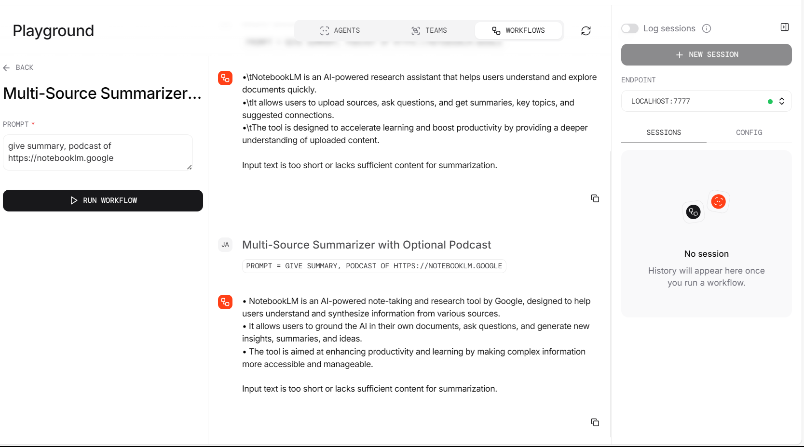
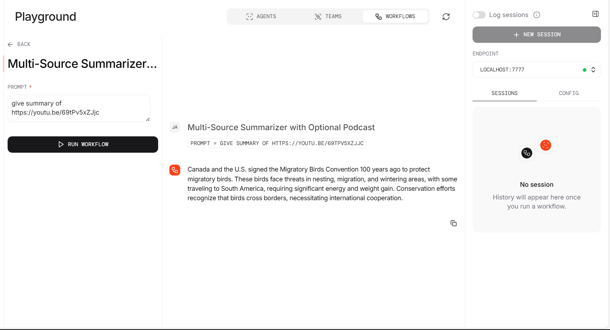
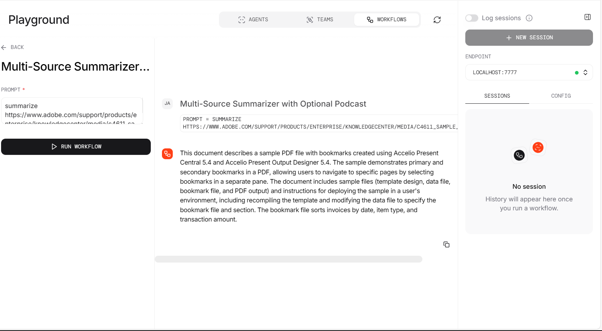
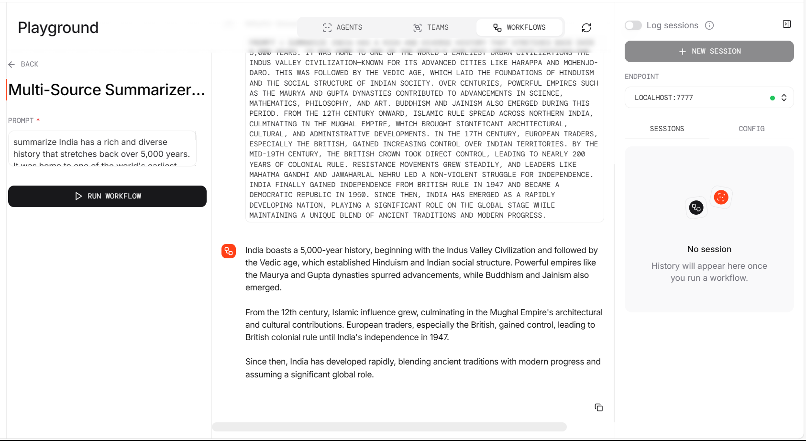
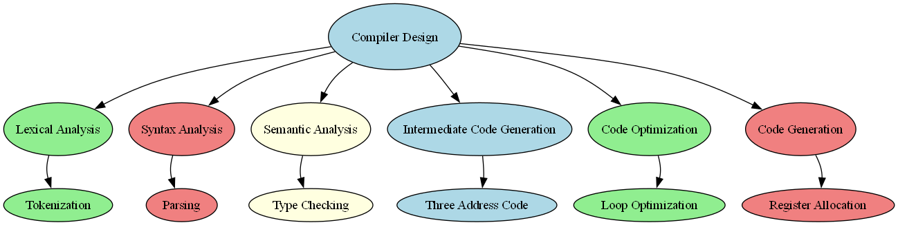

Multi-Source Summarization and Podcast Generation
--
The l5-1.py, l5-2.py, and MultiSource Application workflows form a progressive content-to-podcast pipeline built using the Agno AI framework. These workflows extract and summarize content from sources like PDFs, YouTube videos, webpages, and plain text, converting it into engaging audio using TTS. 

l5-1.py is a basic monologue workflow with a single agent and minimal processing. 

l5-2.py enhances this with a dialogue format, two speaker agents, modular routing, and more natural audio output. 

The most advanced, MultiSource Application, introduces a multi-agent, multi-modal architecture with agents for podcast generation, mindmap creation, dynamic routing, and robust error handling. It also features SQLite caching, visual outputs, and detailed step tracing—making it highly extensible and production-ready.

Key Differences Between l5-1.py and l5-2.py and MultiSource Application:

| **Feature**                         | **l5-1.py (Monologue)🎙️**    | **l5-2.py (Dialogue) 🗣️🗣️**             | **MultiSource Application 🚀**                                                     |
| ----------------------------------- | ------------------------------ | ----------------------------------------- | --------------------------------------------------------------------------------------------- |
| **Podcast Style**                   | Single speaker 🧍‍♂️           | Two speakers in dialogue format 👥        | Two speakers, team-generated dialogue, TTS for each 👥🎤                                      |
| **Podcast Agent/Team**              | One agent 👤                   | Team of two speaker agents 👥👤           | Modular team: podcast agent, podcast team, audio workflow, mindmap agent, etc. 🧠🧩           |
| **Audio Segment Combination**       | Not combined ❌                 | Combined with natural pauses ⏸️✅          | Combined with natural pauses, multi-segment TTS, final MP3 ⏸️✅                                |
| **URL Extraction & Classification** | Regex-based function 🔗🧾      | Dedicated agent with JSON correction 🤖🧹 | Dedicated URL handler agent + JSON corrector agent 🤖🧹                                       |
| **Modular Agent/Team Structure**    | Basic setup 🧩                 | Advanced modular team structure 🧠🧩      | Highly modular, multi-agent, multi-team structure 🧠🧩🚦                                      |
| **Routing**                         | Manual routing in workflow 🛠️ | Team-based dynamic routing 🔄🤝           | Dynamic, multi-level routing: content type → agent/team 🔄🤝                                  |
| **Error Handling**                  | Basic try/except handling ⚠️   | Stepwise and granular error recovery 🪜✅  | Granular, stepwise error handling with logging, cache fallback, agent-level recovery 🪜✅📝    |
| **Intermediate Step Streaming**     | Limited or minimal 🔄🚫        | Extensive and transparent streaming 🌐    | Extensive streaming of intermediate steps, agent logs, and tool calls 🌐📝                    |
| **User Engagement**                 | Lower engagement 📉            | Higher engagement via natural dialogue 📈 | Highest engagement: dialogue, multi-modal output (audio, mindmap), and detailed feedback 📈🚀 |
| **Podcast Voices**                  | Single voice 🗣️               | Two distinct voices 🗣️🗣️                | Two distinct voices, configurable, TTS per speaker, combined MP3 🗣️🗣️                       |
| **Mindmap Generation**              | Not available ❌                | Not available ❌                           | Fully automated mindmap generation via agent, outputs PNG 🧠🖼️                               |
| **Caching**                         | Not available ❌                | Not available ❌                           | SQLite-based caching for prompt/response and file existence 🗄️✅                              |
| **Extensibility**                   | Low 🧩                         | Medium 🧩🧩                               | High: easily add new agents, teams, workflows, and tools 🧩🧩🧩                               |


⚙️ **Setup**

Create a .env file in the project root:

```
GOOGLE_API_KEY=your_google_api_key
ELEVEN_LABS_API_KEY=your_elevenlabs_api_key
LANGFUSE_PUBLIC_KEY=your_langfuse_public_key   # optional
LANGFUSE_SECRET_KEY=your_langfuse_secret_key   # optional
```

🧩 Use Cases
- Educational content creation (podcasts & mindmaps from notes)
- Research summarization and visualization
- Content repurposing (text → audio/visual)
- Knowledge management at scale


OUTPUT:
--
WebPage:(https://notebooklm.google)


YouTube Video: (https://youtu.be/69tPv5xZJjc)


PDF : (https://www.adobe.com/support/products/enterprise/knowledgecenter/media/c4611_sample_explain.pdf)


Plain Text:


MindMap Example :


Podcast Example:

[Click here for demo video](../assets/460637572-3257ca7f-0e8e-4d6f-8568-b210e73b4c41.mp4)

